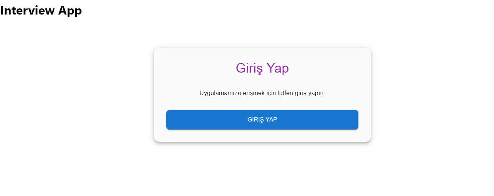
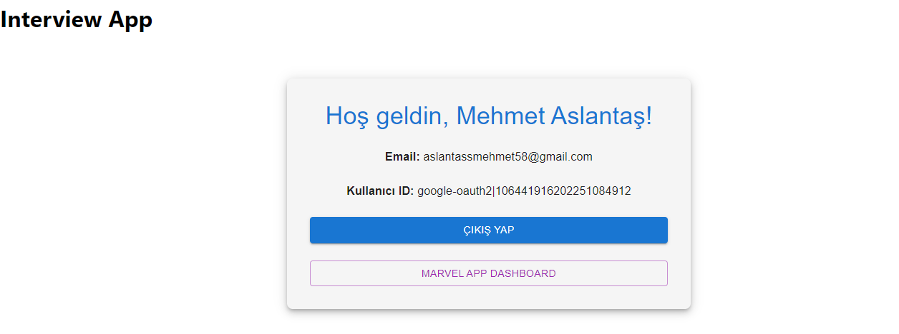
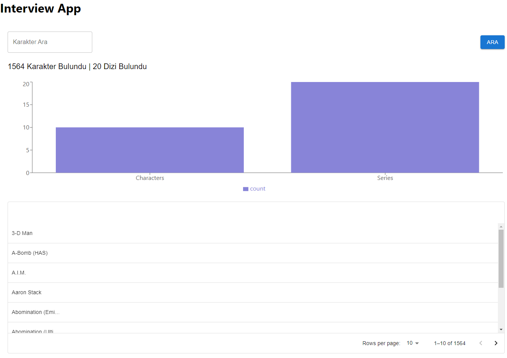

# Interview App

## Purpose

The **Interview App** is a web application designed for managing user authentication and providing a dashboard for browsing Marvel characters and series. It integrates Auth0 for authentication and the Marvel API for data retrieval, implementing a microfrontend architecture.

## Features

- User login and logout functionality using Auth0.
- Marvel character and series management with pagination, search, and filtering.
- Visual representation of character and series statistics through charts.
- Responsive design for optimal viewing on various devices.

## Installation

### Prerequisites

- Node.js (version 14 or higher)
- npm or yarn

### Steps to Set Up

1. Clone the repository:

   ```bash
   git clone <repository-url>
   cd interview_app
   npm install
   ```
 or
yarn install


### Create a .env file in the root directory and add your Marvel API credentials
# REACT_APP_AUTH0_DOMAIN=
# REACT_APP_AUTH0_CLIENT_ID=
# REACT_APP_AUTH0_AUDIENCE=
# REACT_APP_MARVEL_PUBLIC_KEY=
# REACT_APP_MARVEL_PRIVATE_KEY=

### Start the application
npm start
or
yarn start


### Usage
## Login: Upon navigating to the homepage, you will be prompted to log in. Please use your credentials to gain access to the application.
## Marvel Dashboard: After logging in, you can access the Marvel dashboard where you can search for characters, view statistics, and see detailed information.


### Screenshots

### Giriş Ekranı


### Kullanıcı Profili


### Marvel App Dashboard


### Dependencies
React
React Router
Auth0
Material-UI (MUI)
Recharts
Axios
CryptoJS
Redux
@mui/x-data-grid
